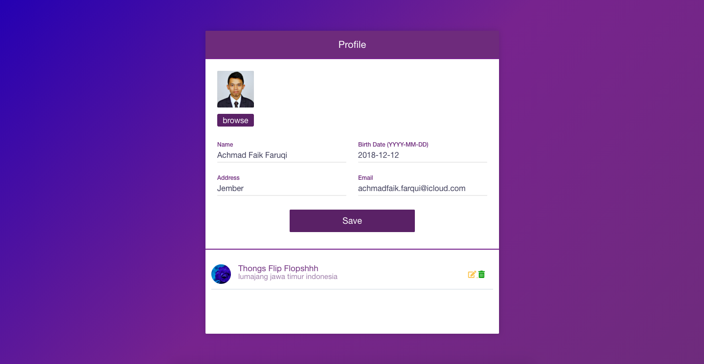
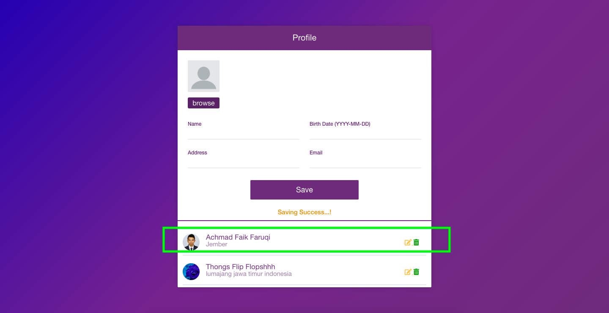
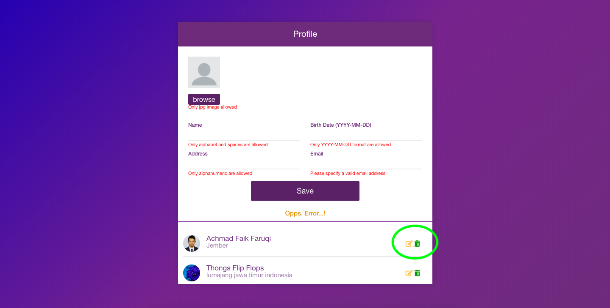

# TEST KapanLagi
> Simple MVC

- Use MVC concept
- Use activerecords
- Use & create library
- Use Helper
- Autoloading resources
- Ajax usage on CRUD function

# REQUIREMENT

```sh
php 5.4 >
mySQL Database
Apache server
```

## INSTALLATION


```sh
clone this repo
import database
move project to htdocs
change database config on models/config.php
install composer
run composer update
well done and open it on browser
```

## USAGE EXAMPLE

> create new user

- Name : Only alphabet
- BirthDate : in YYYY-MM-DD format
- Address : can be alphanumeric
- eMail : must in valid email format
- Photo : only jpg, max 20Mb in size
- show error notification when one of the fields are invalid
- Resized and Cropped into 2 sizes 600x600 and 240x240
- image saved as [ORIGINAL FILE NAME]-[SIZE].jpg




saved data will append below form




> Form validation

- all data must valid data as required
- pen icon is link for edit and update the data
- trash icon is button for remove data



-when update or save is success, the message will appear below the button save


## VERSION HISTORY

* 1.0
    * Version 1.0 

## Meta

Achmad Faik Farqui  –
achmadfaik.alfaruqi@gmail.com
